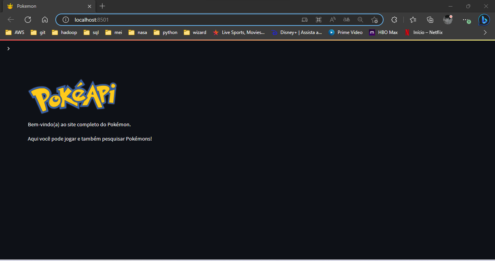
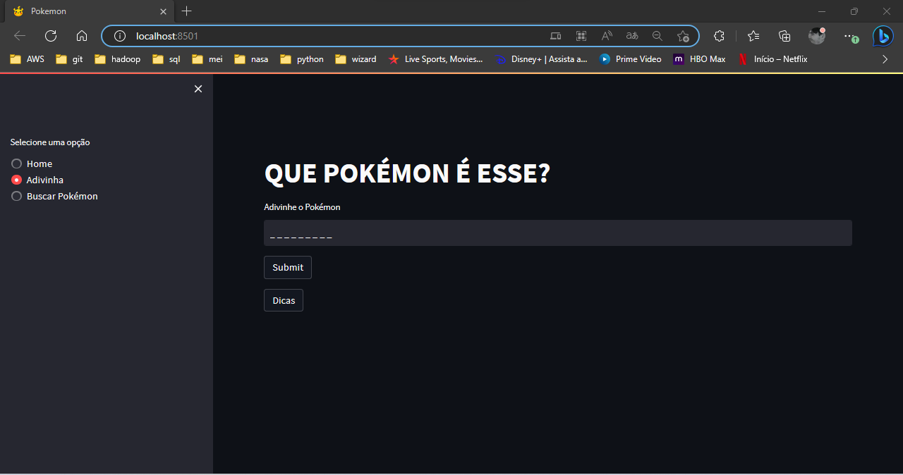
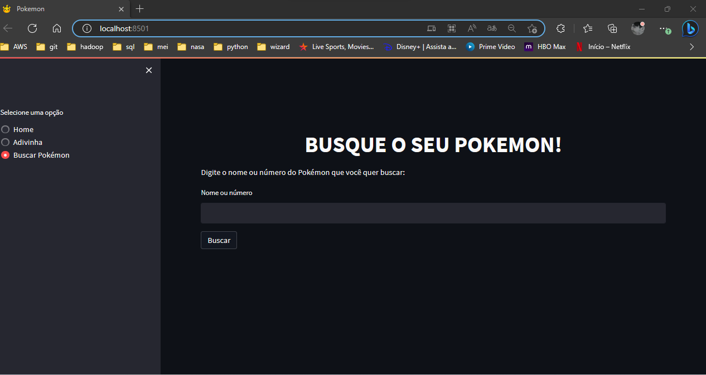

<h1 align="center">
  
</h1>

<h3 align="center">StreamLit Pokemon</h3>
<h3 align="center">=================</h3>

<h3>About the project</h3>

<p>The project is a study on Python's Streamlit tool on top of pokémon's api. In this project we create a local site that contains two menus; query pokémon and guess which pokémon it is. In the pokémon query, a search is performed that returns visual information of the requested pokémon. Guess what pokémon it is, this is a hangman-style game.</p>

<h3>How to Run</h3>

<p>Clone the repository to your computer and run the ```run.sh``` file.</p>


<h3>Output</h3>

<h5>Main menu</h5>
<p align="center">
  
</p>

<h5>Adivinha</h5>
<p align="center">
  
</p>

<h5>Busca</h5>
<p align="center">
  
</p>